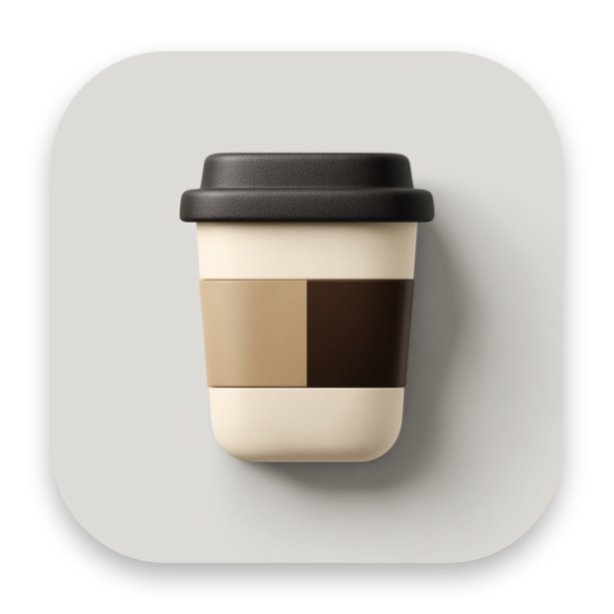
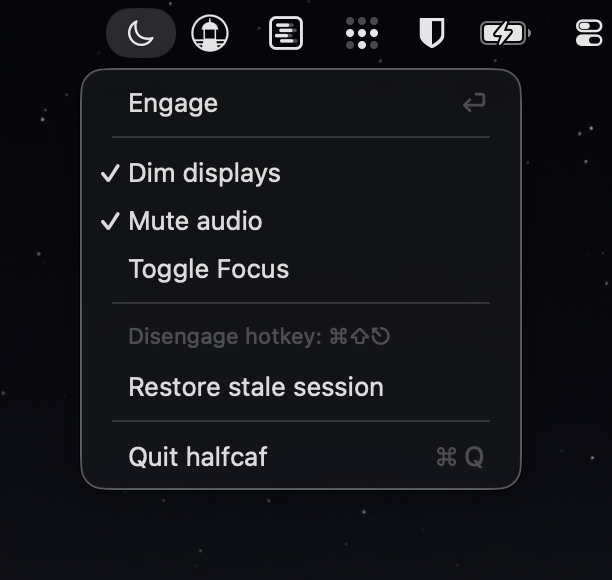

<p align="center">
  
</p>

<h1 align="center">Halfcaf</h1>

<p align="center">
  Headless work mode for macOS. One menu bar click, and your Mac
  goes dark while your work keeps going. Reverses cleanly when
  you return.
</p>

<p align="center">
  <a href="https://halfcaf.app">halfcaf.app</a>
</p>

---

## Install

```sh
brew tap rasterandstate/tap
brew install --cask halfcaf
```

That installs the menu bar app into `/Applications` and the
companion CLI onto your `PATH`.

CLI only:

```sh
brew install rasterandstate/tap/halfcaf
```

Or grab the latest signed and notarized DMG directly from
[downloads.halfcaf.app/halfcaf-1.0.0.dmg](https://downloads.halfcaf.app/halfcaf-1.0.0.dmg).

Requires **macOS 14 (Sonoma) or later** on **Apple Silicon**.

## What it does

When you walk away from your Mac:

- Holds a system power assertion so background work keeps running.
- Dims every active display to 0 (the panel goes black; backlight
  off; auto-brightness can't fight you).
- Mutes audio.
- Optionally enables a Mac-only Focus mode so notifications don't
  light up the room.

When you come back, every captured value is restored. SIGKILL,
crash, hard reboot, the auto-restore on next launch reverses the
state. The CLI uses `IOPMAssertion` so the kernel handles the
caffeination side under any termination.

<p align="center">
  
</p>

## Why

`caffeinate`, Amphetamine, and Raycast Coffee answer "how long
should I prevent sleep?" None of them answer "the user is absent
but the work is not."

The old workaround was hand-assembled state: caffeinate, plus
manually dim brightness to zero, plus DND on, plus mute. Then
remember to undo all of it.

Halfcaf collapses that into one declarative command (or one menu
bar click) with a clean reverse on exit.

The name is a barista term, half-caffeinated: full system
caffeination, but display, audio, and notification stimulation
dialed back.

## Use it

From the menu bar:

1. Click the moon icon
2. Click **Engage**
3. Walk away
4. When you return, hit **⌘⇧⎋** anywhere (works while the screen
   is dark) or click **Disengage**

From the terminal:

```sh
halfcaf                       # engage; Ctrl+C to disengage
halfcaf -t 4h                 # disengage automatically after 4 hours
halfcaf -- ./long-render.sh   # disengage when the command exits
halfcaf -w 12345              # disengage when pid 12345 exits
halfcaf --status              # show the active session
```

## Privacy

Halfcaf does not phone home. It has no telemetry, no analytics,
no crash reporter. It reads your display brightness, audio mute
state, and the name of your current Focus mode at engage time,
writes those values to
`~/Library/Application Support/halfcaf/state.json`, and uses them
to restore at disengage time. That file never leaves your Mac.

The CLI uses Apple's private `DisplayServices` framework via
`dlopen` to read and set brightness on Apple Silicon, since no
public API exists. This is the same path used by BetterDisplay
and MonitorControl.

## License

MIT. Copyright © 2026 Stephen Way / Raster & State.
